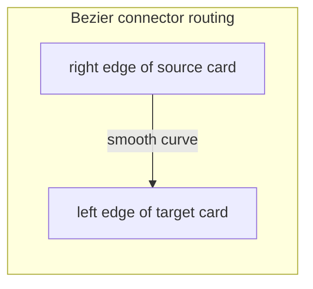

# Board View Spec

## Purpose

Define the layout, interaction model, and visual rules for the graphical backlog board view in AgentLogViewer.

This spec governs the board surface only. For the portfolio dashboard and project detail table view, see `docs/ui-spec.md`. For data contracts used by the board, see `docs/architecture.md`.

---

## Entry Point

- Each project tile in the portfolio dashboard exposes a **Board** button.
- Clicking Board opens the board view for that project.
- The board view replaces the full split-panel workspace (both the portfolio column and the detail column disappear).
- A **Back** button returns the user to the portfolio dashboard.
- The board view loads immediately if project detail is already in memory; otherwise it shows a loading state while the detail request completes.

---

## Layout

### Overall Structure

The board view is a full-width panel with:
- a header row containing the project name and the Back button
- a scrollable board area containing a vertically stacked list of swimlanes, one per owner zone
- the entire board scrolls as a single surface (both horizontally and vertically)

### Swimlane Structure

```mermaid
graph LR
    subgraph "ZONE-NAME (swimlane)"
        direction LR
        A["Card A"] --> B["Card B"] --> C["Card C"]
    end
    style A fill:#1a1a2e,stroke:#9fe0b4
    style B fill:#1a1a2e,stroke:#9fe0b4
    style C fill:#1a1a2e,stroke:#9fe0b4
```

- Zone label sits above the track, left-aligned, uppercase, in accent color.
- Cards flow left to right within the track in their original backlog order.
- Swimlanes stack vertically within the board area with a compact gap (~28px).

### Card Ordering

Cards within each zone are sorted by topological depth — the length of their longest dependency chain across all zones. This ensures every card appears to the right of all its dependencies within the same zone. Ties in depth preserve original backlog order. There is no global column alignment or gap spacers between zones. Cross-zone dependency ordering is communicated through connector lines that appear on card selection (see Connector Lines below).

### Drag-to-Scroll

Clicking and holding on any non-card area of the board, then dragging, pans the board in both axes. This provides a natural panning interaction in addition to scrollbars and mouse wheel.

- Cursor changes to `grab` on hover over empty board space, `grabbing` while dragging.
- Drag-scroll does not interfere with card click/select interactions. A drag that started from empty space must **not** deselect the currently selected card — the selection (and visible connector lines) must survive drag-to-scroll so the user can pan to follow a line to its target.

### Auto-Scroll

On load and on each board navigation, the view scrolls vertically to the first non-`done` item across all swimlanes. That card receives a visual accent (e.g. highlighted border) to identify it as the current focal point.

---

## Card Design

Each card is a fixed-width panel (~240px). Cards use comfortable padding and a clear visual hierarchy.

### Required Fields

| Field | Display |
|---|---|
| Item ID | Monospace label, top-left |
| Status | Color-coded badge, top-right |
| Title | Primary text, 3-line clamp if long |
| Notes | Secondary text below title, 2-line clamp, muted color |
| Dependencies | Chips below notes (see below) |
| Validation indicator | Bottom of card, done items only (see below) |

### Status Colors

| Status | Color |
|---|---|
| `blocked` | Red / danger |
| `in_progress` | Green / accent |
| `todo` | Amber / warn |
| `done` | Muted, reduced opacity (~40%) |
| `postponed` / `unknown` | Muted neutral |

### Dependency Chips

Each ID from the `dependsOn` field is shown as a small chip.

- Chip color: muted/met when that dependency is `done`; amber/unmet when the dependency is not `done`.
- Chips provide a quick at-a-glance summary. Full dependency relationships are communicated via connector lines on selection.

---

## Connector Lines

Connector lines are **hidden by default** and appear only when a card is selected. When a card is clicked, smooth bezier connector lines with arrowheads show the selected card's direct dependencies and direct dependents.

### What Is Shown

When a card is selected, the board draws lines for:
- **Upstream (dependencies)**: Lines from each card the selected card depends on, pointing toward the selected card.
- **Downstream (dependents)**: Lines from the selected card to each card that depends on it.

Only direct (one-hop) relationships are shown. Clicking a different card switches the visible lines. Clicking empty space or the same card again hides all lines.

### Routing Shape

Connectors are smooth cubic bezier curves that exit the **right edge** of the source card and enter the **left edge** of the target card (reversed when the target is to the left). This avoids any need for vertical gutter space between swimlanes and keeps lines visually clean across zones.

- The curve exits horizontally from the source card edge at its vertical center.
- Control points create a smooth S-curve that scales with the horizontal distance between cards.
- The curve enters horizontally at the target card edge at its vertical center.
- The curve terminates with an arrowhead.

### Line Appearance

- Upstream dependency lines (cards the selected item depends on):
  - `rgba(159, 224, 180, 0.85)` — dependency is `done` (green)
  - `rgba(243, 184, 109, 0.9)` — dependency is not yet `done` (amber)
- Downstream dependent lines (cards that depend on the selected item):
  - `rgba(120, 180, 255, 0.9)` — accent blue
- Line width: 2px
- Arrowhead: small filled triangle matching line color
- Lines render above cards (`z-index: 3`) with `pointer-events: none`.

### SVG Implementation Notes

- The SVG overlay spans the full board (all swimlanes), not per-swimlane, since connectors cross between tracks.
- The SVG element is positioned absolute over the full board scroll area with `z-index: 3` (above swimlanes at `z-index: 1`).
- SVG dimensions match the full scrollable extent of the board, not the viewport.
- Drawing is imperative (direct DOM manipulation) to avoid re-render loops.
- The SVG is cleared and redrawn each time the selected card changes.
- When no card is selected, the SVG is hidden (`display: none`).

---

## Focus Mode (Click-to-Focus Interaction)

Clicking a card activates **focus mode**, which isolates the selected card's dependency graph from the rest of the board. Deselecting reverses the process. All transitions are animated.

### Selection

- Clicking a card selects it and enters focus mode.
- Clicking a different card switches focus mode to that card.
- Clicking anywhere outside a card deselects and exits focus mode.

### Focus Mode Behavior

When a card is selected, the board transitions through three simultaneous animated effects:

#### 1. Non-participating items fade out

Cards that are not the selected card, not a direct dependency, and not a direct dependent fade to 0 opacity and are removed from flow (`display: none` after the fade completes). This clears visual clutter so only the relevant subgraph remains.

#### 2. Connector lines fade in

Bezier connector lines (see Connector Lines above) fade in from 0 to full opacity over the same animation duration. Lines appear simultaneously with the card fade-out so the dependency graph becomes visible as noise disappears.

#### 3. Participating items compact toward the focus card

After non-participating items are removed from flow, the remaining participating items (selected + deps + dependents) reflow naturally within their swimlanes. Because non-participating cards are `display: none`, the remaining cards pack together, forming a compact view centered around the dependency subgraph.

- Items stay in their original swimlanes (no cross-zone movement).
- Items stay aligned in the swimlane grid (same card width, same flex layout).
- Swimlanes that contain zero participating items collapse entirely (the swimlane element including its label is hidden).

#### Animation Timing

All three effects happen concurrently over a single animation duration (~250ms):
- Non-participating cards: opacity 1 → 0, then `display: none`
- Connector lines: opacity 0 → 1
- Participating cards reflow naturally as siblings disappear

#### Deselection (Exit Focus Mode)

Deselecting reverses the process:
1. Non-participating items return to flow (`display` restored) and fade back to full opacity.
2. Connector lines fade out and are removed.
3. Empty swimlanes re-expand.
4. All cards return to their original positions as the full board reflows.

### Highlight State

While in focus mode, participating cards receive highlight styling:

| Relationship | Visual Treatment |
|---|---|
| Selected card | Accent border + glow |
| Immediate dependency, `done` | Muted green border glow |
| Immediate dependency, not `done` | Amber border glow, full opacity |
| Immediate dependent | Accent blue border, dimmer than selected |

"Immediate dependency" means the selected card depends on it directly (one hop). "Immediate dependent" means it depends on the selected card directly.

Highlight state only reflects direct (one-hop) relationships, not transitive.

Connector lines and highlight states appear together with the focus mode animation.

---

## Validation on Done Cards

Done cards must communicate their validation status clearly.

### States

| Condition | Display |
|---|---|
| No validation rules recorded | Small muted label: "No validation rules" |
| Has rules, not yet validated | Amber "Validate" button |
| Has rules, validated, fingerprint current | Green "Validated" chip |
| Has rules, validated, fingerprint stale | Green "Validated" chip + amber "May be outdated" warning |

A "validation rule" is present when the item has a non-null `validation` field OR when a matching log entry contains a boss review instruction set (`runThis`, `openThis`, or `expectThis`).

A validation fingerprint is considered stale when the stored fingerprint no longer matches the fingerprint computed from the current item state.

### Validation Overlay

Clicking the Validate button (or the Validated chip when rules exist) opens a centered overlay.

- The overlay renders via `createPortal` into `document.body` so it is not clipped by any parent `overflow`, `backdrop-filter`, or `transform`.
- Backdrop: full-screen dark semi-transparent, click closes the overlay.
- Panel: centered, max-width ~560px, scrollable if content is long, rounded, dark green.
- Close button: top-right corner of panel, clicking closes.
- Escape key closes the overlay.
- Panel content:
  - Item ID and title
  - `validation` field if present
  - Instruction set block (`Run:`, `Open:`, `Expect:`) if a matching log entry exists
  - Stale warning if fingerprint is outdated
  - Mark Validated / Mark Not Validated button
  - "Validated in this viewer" confirmation when validated

Validation state is persisted in `localStorage` keyed by `projectPath::itemId`. It is viewer-local, not written back to any source file.

---

## Error Handling

The board must not blank the application on render errors.

- Wrap the board render tree in an error boundary.
- Display a recoverable error state with the error message and a Retry button.
- Retry resets the error boundary so the user can try again without a page reload.

---

## Out of Scope

- Editing backlog items from the board
- Writing validation results back to source files
- Transitive (multi-hop) dependency highlighting in v1
- Expandable `Done When` or `Write Scope` fields on cards (may be considered for card expansion in a later iteration)
